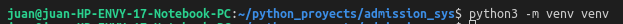
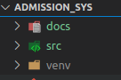

# venv — Creation of virtual environments

## Creating virtual environments
### Creation of virtual environments is done by executing the command venv:
`python3 -m venv /path/to/new/virtual/environment`

### On Windows, invoke the venv command as follows:
`c:\>c:\Python35\python -m venv c:\path\to\myenv`

### Source
[docs.python.org](https://docs.python.org/3/library/venv.html)

### My example

1. Ejecuto el comando en mi terminal

2. Reviso si se ha creado correctamente el directorio `venv`

