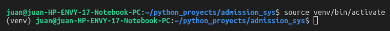
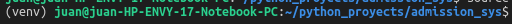

# Usando el entorno virtual y PIP

1. En la terminal, localizar dentro de venv el fichero activate, asi:

2. Si todo ha ido bien, deberías de ver en tu prompt `(venv)`

3. Si vas instalar la primera vez, te conviene instalar todos los paquetes

`pip install -r /path/to/requirements.txt`